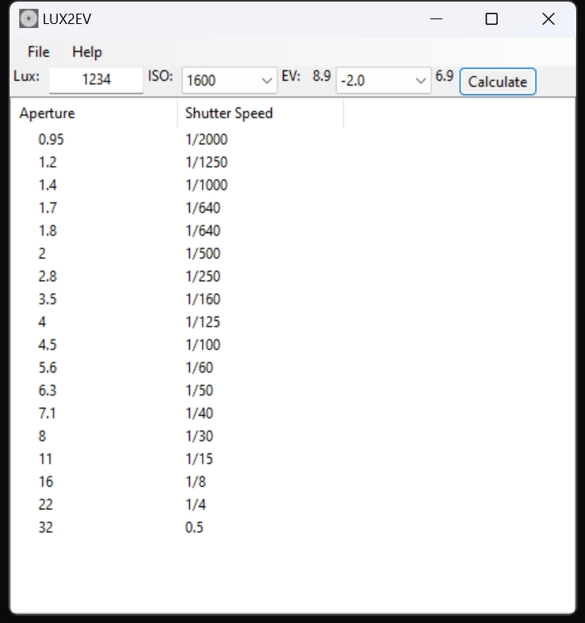

# LUX2EV_beeware
A very easy-to-use small software that uses the lux value measured by the illuminance meter to calculate the shutter speed under different ISO and aperture, and assist photography. 


## Prerequisites

- Python 3.9+
- beeware
- briefcase
- toga

## Installation


```Bash
pip install beeware briefcase toga
git clone https://github.com/EasyCam/LUX2EV_beeware
cd LUX2EV_beeware/lux2ev
briefcase dev
briefcase update android
briefcase build android
briefcase run android
```

## Usage

Just input the Lux value and select an ISO, and the software will calculate the shutter speed under different aperture.




# This cross-platform app was generated by** `Briefcase`_ **- part of**
`The BeeWare Project`_. **If you want to see more tools like Briefcase, please
consider** `becoming a financial member of BeeWare`_.

