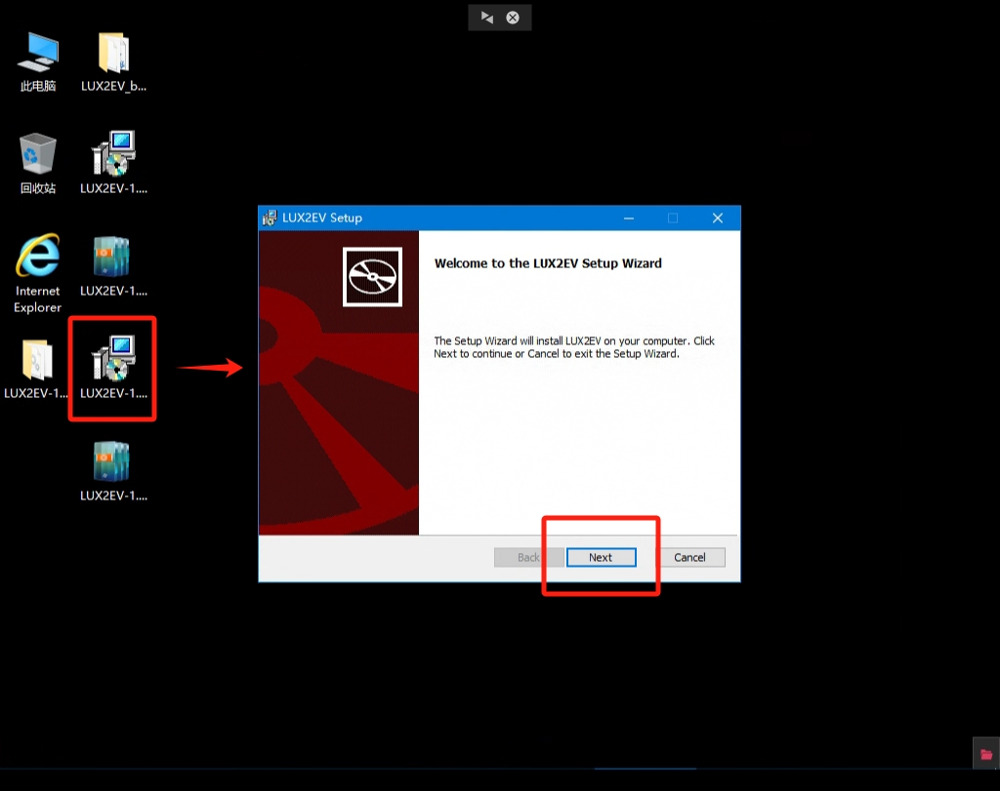
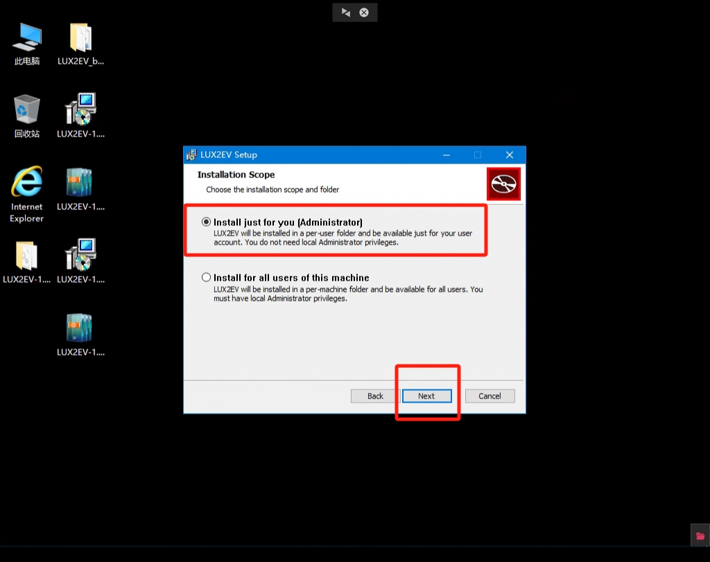
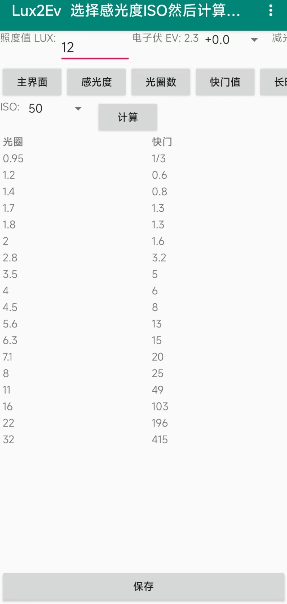

# LUX2EV_beeware Documentation

A tool for calculating photographic exposure parameters based on the BeeWare framework and the Toga graphical interface library.

## 1. Software Introduction

LUX2EV_beeware is a graphical interface tool for the calculation of photographic exposure parameters. It is developed in Python and uses the BeeWare framework and the Toga graphical interface library.

### 1.1 Background

Exposure parameters are very important and complex concepts in photography. They determine the degree of lightness and darkness, detail presentation and color accuracy of a photo, which directly affects the quality and expressiveness of the photo.

Exposure parameters include aperture, shutter speed and ISO sensitivity. Aperture controls the amount of light entering the camera and determines the depth of field and sharpness of the image. Shutter speed controls the length of the camera's exposure, affecting the sharpness of moving objects and the stability of still scenes, while ISO sensitivity determines the camera's sensitivity to light, affecting image noise and the ability to capture detail.

Setting the exposure parameters correctly is one of the skills a photographer must master. Overexposure (too bright) or underexposure (too dark) can lead to a drop in image quality, loss of detail or increased noise. At the same time, different shooting scenes and subjects require different exposure parameters to achieve the desired results. For example, shooting night scenes requires longer shutter speeds and higher ISO sensitivities, while shooting moving objects requires shorter shutter speeds and smaller apertures.

Because of the complexity of exposure parameters, photographers need to adjust and balance them accordingly. Some photographers tend to use manual mode for complete control of exposure parameters, while others prefer to use automatic or semi-automatic modes to quickly get the right exposure.

In the field of photography, the traditional means of metering is to use a specialized photographic light meter. However, these devices are expensive and have limited functionality and lifetime, which makes it especially difficult to cope with special scenes that require complex exposures, multiple exposures, and combinations of exposures.

To address this problem, this software is designed to provide photographers with an easy-to-use tool. Users only need to input the illuminance value of the corresponding scene, and then they can freely choose the ISO sensitivity, aperture size, exposure time and other parameters, and get the optimal exposure parameters through calculation.

### 1.2 Introduction

The main function of this software is to select the ISO sensitivity according to the inputted illuminance value and calculate the corresponding shutter speed under different apertures.

In the software, the user can select different ISO sensitivities and adjust the aperture size via the slider bar in order to calculate the optimal exposure parameters at different apertures. In this way, the photographer can focus more on composition and creation without having to pay too much attention to the adjustment of exposure parameters.

The functional flow of the software is designed as follows:


### 1.3 Development Environment

The development environment used for this software is as follows:

| library | version | description |
|----------|----------|------------------------|
| Python | 3.11.5 | Interpreter with runtime support |
| beeware | 0.3.0 | Project framework, provides runtime framework |
| briefcase| 0.3.16 | Project Manager, provides packaging support |
| toga | 0.4.1 | Graphical interface library, provides graphical interface support | | numpy | 1.3.0 | project manager, provides packaging support
| numpy | 1.26.2 | Numerical libraries, support for numerical computation | pandas | 2.2.1 | Numerical libraries, support for numerical computation
| pandas | 2.1.4 | Table processing library, provides table processing and CSV file export support | | numpy | 1.26.2 | Numerical computation library, provides numerical computation support

## 2. Installation and Operation

Thanks to the cross-platform development environment and libraries, the software supports a variety of hardware devices and operating systems, as well as a variety of installation and operation methods.

### 2.1 Hardware Environment

The following hardware environments are used to run the software:

| Hardware Items | Minimum Configuration Requirements |
|----------------------------------|------------------------------------|
| Processor | Intel X86_64, AMD64 64-bit processor or ARM64 64-bit processor, dual-core, 1GHz or higher |
| Running Memory (RAM) | 4 GB or above | Free Local Hard Disk Space | Running Memory (RAM) | 4 GB or above
| Free Local Hard Disk Space | 1 GB or more


### 2.2 System Environment

This software runs on the following operating system:

| Operating System | Minimum Version Requirement | Architecture |
|----------------------------------|-------------------------|------------|
| Windows 10 | 1809 | 64-bit |
| Ubuntu | 22.04.3 | 64 bit |
| Android | 13 | 64 bit |

### 2.3 Install and Run

#### 2.3.1 Python Interpreter Runs

This runtime is available for a variety of operating systems, including Windows and GNU/Linux.The steps are as follows:

First, you need to install the Python interpreter (see the official Python documentation for installation).
Next, use the pip command to install the beeware, briefcase, and toga libraries.
Then, use the git clone command to download the source code for this software.
Once the download is complete, go to the source code path.
Finally, run the software using the briefcase run command.

Execute the following command in the terminal to complete the run process. Use Powershell on Windows and BASH or ZSH on Linux and macOS.


```Bash
pip install beeware briefcase toga # install dependent packages
git clone https://github.com/EasyCam/LUX2EV_beeware # download the source code
cd LUX2EV_beeware/lux2ev # go to the code path
briefcase run # start running
```

The interface is shown below:
{ width=720 }

#### 2.3.2 Running Green on Windows


This type of run is applicable to Windows 10 1809 and above. The steps are as follows:

First, you need to visit [the release page of this project](https://github.com/EasyCam/LUX2EV_beeware/tree/main/release), and select the zip for your language version in that page. If you need the Chinese version, please select the zip with "cn"; if you need the English version, please select the zip with "en".

After downloading, you need to extract the zip file to your favorite directory. After decompression, you will find a file named "LUX2EV.exe" in the corresponding directory.

Finally, double-click the file to run it and start the software.


The interface is shown below:
{ width=720 }


#### 2.3.3 MSI Installation Run on Windows


This run is available for Windows 10 1809 and above. You can follow the specific steps below to complete the installation and launch the software:

1. First, visit [the release page for this project](https://github.com/EasyCam/LUX2EV_beeware/tree/main/release). On this page, you can select the appropriate wsi file according to your language preference. If you want the Chinese version, please select the wsi file with "cn"; if you want the English version, please select the wsi file with "en". 2.

2. After the download is complete, double-click the downloaded wsi file to install it. The installation process may take some time, so please be patient.

3. After the installation is complete, you can find the LUX2EV start button in the start menu. Click on this button to start the software.

Please note that it is important to make sure that your computer meets the minimum configuration requirements to run the software and that you have the appropriate Python interpreter installed. If you do not have the Python interpreter installed, please refer to the official Python documentation to install it.


The installation is shown in the following pictures:
{ width=720 }
{ width=720 }
{ width=720 }
{ width=720 }

The interface is shown below:
{ width=720 }

#### 2.3.4 Android platform operation


This method of operation is applicable to Android 13 and above. You can follow the specific steps below to complete the installation and launch the software:


1. First, turn on the developer options on your Android device and enable USB debugging.
2. Connect your Android device to your computer using a USB cable and agree to the license. 3.
3. Install the Python interpreter on your computer (please refer to the official Python documentation for installation). 4.
4. Install the beeware, briefcase, and toga libraries using the pip command. 5.
5. Download the source code for the software using the git clone command. 6.
6. After the download is complete, go to the source path. 7.
7. Use the briefcase update Android command to update the configuration. 8.
8. Use the briefcase build Android command to generate an APK file. 9.
9. Use the briefcase run Android command to run the software.


Please execute the above commands in the terminal to complete the running process. Use Powershell on Windows and BASH or ZSH on Linux and macOS.


This process requires internet connection to download and install the third-party components required to run the APP on your Android device, so it may take a long time and may even be interrupted due to various factors such as network stability.


Please note that due to the various resolution settings of Android devices, the interface may have incomplete text, etc., but this will not affect the normal operation of the software. As you can see in the picture below:
{ width=360 }


```Bash
pip install beeware briefcase toga # install dependent packages
git clone https://github.com/EasyCam/LUX2EV_beeware # download source code
cd LUX2EV_beeware/lux2ev # go to the code path
briefcase update Android # Update the configuration
briefcase build Android # Generate APK file
briefcase run Android # Start running
```


Please note that during the above process, the beeware framework requires an internet connection to download and install the third-party components needed to run on the Android device. As a result, this may take longer and may be interrupted due to a variety of factors such as network stability.


In addition, due to the diverse resolution settings of Android devices, the interface may have incomplete text, for example. However, this will not affect the normal operation of the software. As shown in the picture below:
{ width=360 }


## 3. Functions and Usage


In order to satisfy users' needs, the following introduction of features and usage is based on Windows 10 1809 64-bit version as an example. LUX2EV functions and usage under other operating systems can also refer to this section, the logic is basically the same.


### 3.1 Physical Principle


According to the laws of physics, we know:
* The electronic volt (ev) can be calculated from the illumination value (lux);
* There is a mathematical relationship between the electron volt (ev) and the sensitivity (ISO), aperture number (F) and shutter value (S).
Specifically:
$$
\begin{aligned}
\text{ev} &= 2 + \log_2\left(\frac{\text{lux}}{10}\right) \\\\
\text{S} &= \frac{\text{F}^2}{2^{\text{ev}} \times 100 \times \text{ISO}}}
\end{aligned}
$$
Where $\text{ev}$ denotes the exposure compensation, $\text{lux}$ denotes the illuminance value, $\text{ISO}$ denotes the sensitivity, and $\text{F}$ denotes the aperture number.


Therefore, in the buttons of the status switching section, the corresponding electronic volt (ev) value can be obtained according to the current illuminance value, exposure compensation and scrim level.
Then, with the electron volt (ev) fixed, a finite combination of the other two can be calculated by knowing any one of the sensitivity, aperture number or shutter value.


### 3.2 Menu Bar


First, start the software. For Windows 10 users, you can use the MSI installation package to install it, and then search for LUX2EV in the start menu to launch the software. Users of other operating systems can refer to the previous section to start the software.


{ width=720 }
After the software starts, you will first see the main screen and the menu bar located above it. It is important to note that the appearance of the menu bar may vary slightly depending on the operating system the user is using, but its functionality is basically the same.


The main screen provides a shortcut key, Ctrl+Q, for exiting the software.
{ width=720 }
The menu bar under the Help item contains functions for accessing the home page and checking the current version, as shown below:


! [Help menu](. /images/Help.png){ width=720 }


### 3.3 Main Interface


The main interface of the software is divided into three parts from top to bottom:
1. Illumination Control: Includes an input box for entering illuminance (in LUX), a filter for selecting exposure compensation, and a filter for selecting scrim stops.
2. State Switching: Includes five state switching buttons, namely, main interface, sensitivity, aperture number, shutter value and long exposure.
3. Data Presentation: Includes a filter or input box for sub-item values in the current state, a calculation button in the current state, a table of the current data, and a button to save the results.


! [Main Interface](. /images/main-interface.png){ width=720 }


### 3.4 Illumination Control


In the Illumination Control section, the user can enter illuminance, select exposure compensation, and select a scrim stop.
- The illuminance value is measured in LUX (lux) and requires a positive value to be entered.
- After the illuminance is entered, the center electronic VEV value is automatically calculated.
- The Exposure Compensation filter selects exposure compensation from -5ev to +5ev and includes stops of 1/3ev and 1/2ev.
- The Light Reduction Filter contains 11 light reduction stops from 1 to 1024, where 1 means no light reduction, 2 means light reduction to 1/2 of the original value, and so on.


In the illuminance control section, if the user does not enter an illuminance, the default illuminance value is set to 0.1 lux to avoid a situation where zero is involved as the denominator in the calculation.


The values entered and selected in the illumination control section are valid for the entire program.


### 3.5 State Switching


The Status Switching section contains five status switching buttons: Main Interface, Sensitivity, Aperture Number, Shutter Value and Long Exposure.
The main interface button returns to the main interface state, while the other buttons provide multiple calculation processes in the context of illumination control:
* The sensitivity button switches to the sensitivity priority state, which calculates the aperture number with the corresponding shutter value at the current e-volt and sensitivity after selecting the sensitivity;
* Aperture number button switches to the aperture number priority state, after selecting the aperture number it calculates the sensitivity with the corresponding shutter value at the current eV and aperture number;
* The shutter value button switches to the shutter value priority state, and after selecting the shutter value, calculates the sensitivity with the corresponding aperture number at the current eV and shutter value;
* The Long Exposure button switches to the Long Exposure Priority state, where a longer exposure time is entered as the shutter value, and then the sensitivity with the corresponding aperture number is calculated for the current eV and shutter value.


The buttons in the State Switching section are only valid for the current state, and the results generated by the Calculate button only affect the presentation of data in the current state.


#### 3.5.1 Sensitivity Priority State


In the sensitivity priority state, the interface provides a selector to control the ISO, ranging from 50 to 1024000, with 39 stops, including:
[50, 64, 100, 125, 160, 200, 250, 320, 400, 500, 640, 800, 1000, 1250, 1600, 2000, 2500, 3200, 4000, 5000, 6400, 8000, 10000, 12500, 16000, 20000, 25000. 32000, 40000, 50000, 64000, 80000, 100000, 128000, 160000, 200000, 256000, 512000, 1024000].


The ISO adjustment range and selected values here refer to the parameters of the Sony A450 DSLR camera and Sony A7R5 micro camera.
After selecting the ISO, clicking the "Calculate" button will give you the aperture number of each stop and the corresponding shutter value under the current state in the data presentation section.
After selecting ISO and clicking the "Calculate" button, the data presentation section will display the aperture number and corresponding shutter value for each stop in the current state.


The data presentation section will display the aperture number and corresponding shutter value for each stop in the current state. [](. /images/Sensitivity Priority Status.png){ width=720 }


#### 3.5.2 Aperture number priority status


In the aperture priority state, the interface provides a selector to control the aperture number, ranging from 0.95 to 32, with 18 stops in total, including: [0.95, 1.2, 1.4, 1.7, 1.8, 2, 2.8, 3.5, 4, 4.5, 5.6, 6.3, 7.1, 8, 11, 16, 22, 32].


After selecting the aperture number and clicking the "Calculate" button, the data presentation section displays the sensitivity of each stop and the corresponding shutter value in the current state.


The data presentation section will display the sensitivity and corresponding shutter value for each stop in the current state. [](. /images/aperture-number-priority.png){ width=720 }


#### 3.5.3 Shutter value priority status


In Shutter Value Priority state, the interface provides a selector to control the shutter value, ranging from 30 sec to 1/8000 sec, with 55 stops in total, including: [30, 25, 20, 15, 13, 10, 8, 6, 5, 4, 3.2, 2.5, 2, 1.6, 1.3, 1, 0.8, 0.6, 0.5, 0.4, 1/3, 1/4, 1/5, 1/6, 1/ 8, 1/10, 1/13, 1/15, 1/20, 1/25, 1/30, 1/40, 1/50, 1/60, 1/80, 1/100, 1/125, 1/160, 1/200, 1/250, 1/320, 1/400, 1/500, 1/640, 1/800, 1/1000, 1/1250, 1/100, 1/125, 1/160, 1/200, 1/250, 1/320, 1/400, 1/500, 1/640, 1/800, 1/1000, 1/1250, 1/ 1600, 1/2000, 1/2500, 1/3200, 1/4000, 1/5000, 1/6400, 1/8000].


After selecting the shutter value and clicking the "Calculate" button, the data presentation section displays the sensitivity of each stop and the corresponding aperture number in the current state.


The data display will show the sensitivity of each stop and the corresponding aperture number in the current state. [](. /images/shutter-priority-state.png){ width=720 }
        


#### 3.5.4 Long Exposure Priority State


The Long Exposure Priority state is a modification of the Shutter Value Priority state. With a limited number of shutter values, only one stop can be selected from a fixed shutter speed of 55 stops. However, in the Long Exposure Priority state, the user can enter any positive number of shutter values on his or her own, making it suitable for scenarios that require longer exposure times.


In Long Exposure Priority, you can enter the desired shutter value and click the "Calculate" button to get the corresponding sensitivity and aperture in the data presentation section.


The data rendering section will show the corresponding sensitivity and aperture numbers. [](. /images/Long Exposure Priority Status.png){ width=720 }


### 3.6 Data Presentation


In the Data Presentation section, the user can view a table of calculated exposure parameter combinations for the current state. In order to provide a better user experience, the software also has a built-in warning function for abnormal situations.


When the calculated shutter value is less than 1/8000 second, the user will receive the message "More than 1/8000".


The program also has a built-in warning function for abnormal situations. [](. /images/over-1-8000.png){ width=720 }


When the calculated aperture value exceeds the range of 0.95 to 32, the software will output the aperture with a corresponding prompt. If the aperture value is greater than 32, the user will receive the message "Aperture may not be small enough". If the aperture value is less than 0.95, the user will receive the message "Aperture may not be large enough".


{ width=720 }
{ width=720 }


At the bottom of the Data Presentation section, there is a Save button for each state. The user can click on this button to save the current data as a corresponding CSV file. The software will automatically detect the OS version:
* If it is Android OS, the data will be saved under the device's Download path, the exact location is `/storage/emulated/0/Download/`.
* If it is GNU/Linux OS, users need to manually create a `/storage/emulated/0/Download/` path to save the current data file.
* In case of Windows OS, the data will be saved in the current program call directory. Typically, the default location is `C:\Windows\System32`, and the user will need to manually copy or move it to a more convenient directory (e.g., the desktop) and then open and edit it.


This measure is taken for compatibility with file saving for multiple operating systems.


The saved CSV data file can be opened using various table editing software or text editors as shown below:
{ width=720 }


## 4 Getting Help


If you need to get help about this software, you can refer to the following resources:
- Operation Demo Video: You can watch the operation demo video of this software, please refer to the following link:
    - Android: .
    - Windows: .
- Submitting Problems: If you encounter any problems during use, you can go to [the open source page of this software project](https://github.com/EasyCam/LUX2EV_beeware/issues/new/choose) to submit a problem.


## 5 License and Acknowledgments


This software is licensed under the GPL-v3 license, see the [LICENSE](https://github.com/EasyCam/LUX2EV_beeware/blob/main/LICENSE) file for details.


This software is based on an earlier PyQt6 case [LUX2EV](https://github.com/EasyCam/LUX2EV), and we thank all the other folks for their interest and help to the [EasyCam](https://github.com/EasyCam) team.


Thanks to the following open source projects for their contributions:
    - [Beeware](https://beeware.org/)
    - [Toga](https://toga.readthedocs.io/en/latest/)
    - [Pandas](https://pandas.pydata.org/)
    - [NumPy](https://numpy.org/)
    - [PyQt6](https://www.riverbankcomputing.com/software/pyqt/intro)
    - [PySide6](https://wiki.qt.io/Qt_for_Python)
    - [PyQt5](https://riverbankcomputing.com/software/pyqt/intro)
    - [PyQtGraph](https://pyqtgraph.readthedocs.io/en/latest/)
    - [PyInstaller](https://www.pyinstaller.org/)
    - [PyQt5-tools](https://pypi.org/project/PyQt5-tools/)