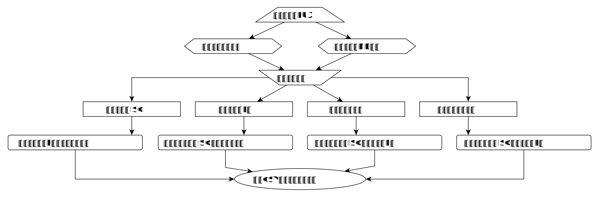
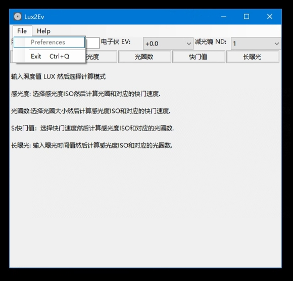
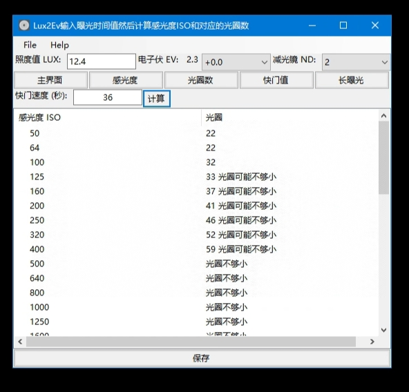
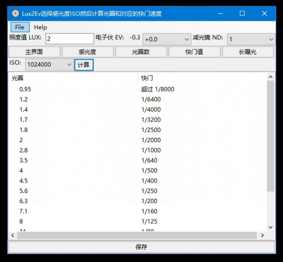
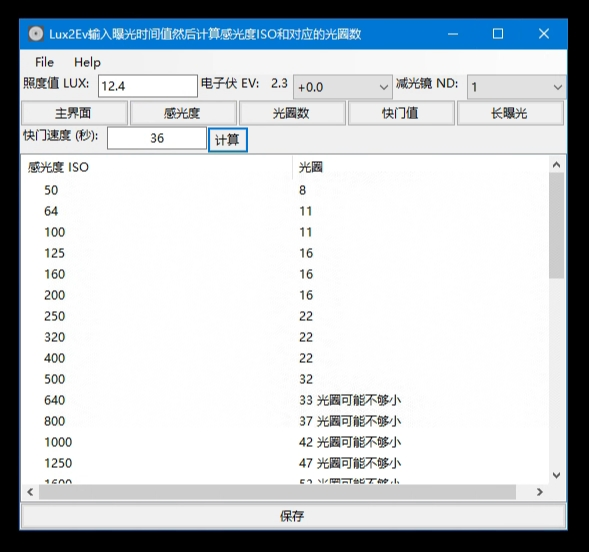
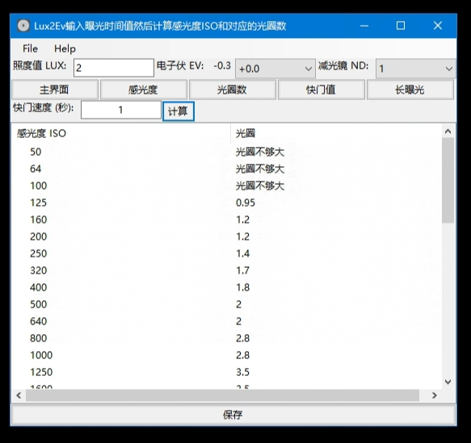
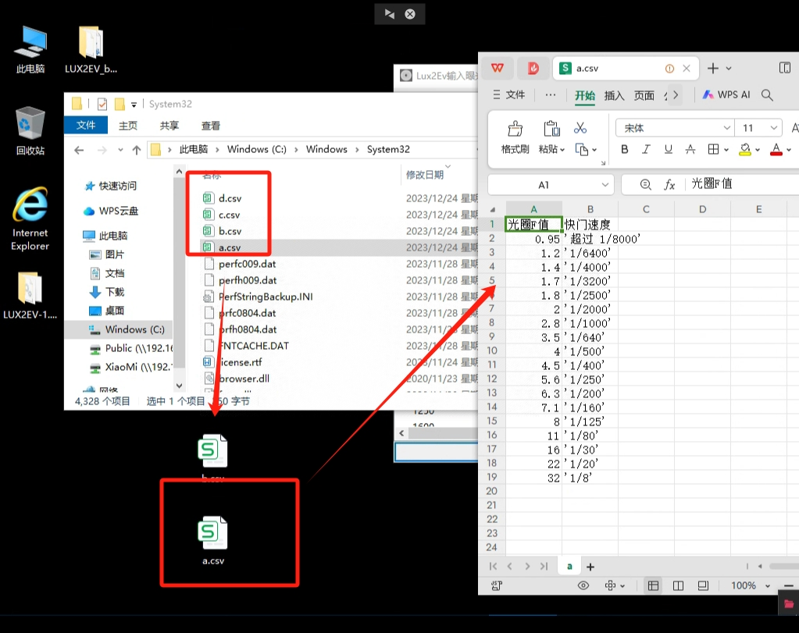

# LUX2EV_beeware 说明文档

一个基于 BeeWare 框架和 Toga 图形界面库实现的摄影曝光参数计算工具

## 1. 软件简介

LUX2EV_beeware 是一个用于摄影曝光参数计算的图形界面工具软件。它使用 Python 语言进行开发，并采用 BeeWare 框架和 Toga 图形界面库。

### 1.1 开发背景

在摄影工作中，曝光参数是非常重要且复杂的概念。它们决定了照片的明暗程度、细节展现和色彩准确性，直接影响着照片的质量和表现力。

曝光参数包括光圈、快门速度和 ISO 感光度。光圈控制着进入相机的光线量，决定了景深和图像的清晰度。快门速度控制着相机曝光的时间长度，影响到运动物体的清晰度和拍摄静态场景时的稳定性。ISO 感光度决定了相机对光线的敏感程度，影响到图像的噪点和细节捕捉能力。

正确设置曝光参数是摄影师必须掌握的技能之一。过曝（过亮）或欠曝（过暗）都会导致图像质量下降，细节丢失或噪点增加。同时，不同的拍摄场景和主题需要不同的曝光参数来达到理想的效果。例如，拍摄夜景需要较长的快门速度和较高的 ISO 感光度，而拍摄运动物体需要较短的快门速度和较小的光圈。

由于曝光参数的复杂性，摄影师需要根据实际情况进行调整和平衡。一些摄影师倾向于使用手动模式来完全控制曝光参数，而另一些摄影师则更喜欢使用自动模式或半自动模式来快速获得合适的曝光。

在摄影领域中，传统的测光手段是使用专用摄影测光表。然而，这类设备价格高昂且功能和使用寿命有限，尤其是难以应对一些需要复杂曝光、多次曝光、组合曝光的特殊场景。

针对这一问题，本软件旨在为摄影师提供一个简单易用的工具。用户只需输入对应场景的照度值，然后可以自由选择 ISO 感光度、光圈大小、曝光时间等参数，通过计算得到最佳的曝光参数。

### 1.2 功能简介

本软件的主要功能是根据输入的光度值，选择 ISO 感光度，并计算出不同光圈下对应的快门速度。

在软件中，用户可以选择不同的 ISO 感光度，并通过滑动条调整光圈大小，以便在不同光圈下计算出最佳的曝光参数。这样，摄影师可以更加专注于构图和创作，而不必过多关注曝光参数的调整。

软件的功能流程设计如下：



### 1.3 开发环境

本软件使用的开发环境如下：

| 库       | 版本      | 说明                   |
|----------|----------|------------------------|
| Python   | 3.11.5   | 解释器，提供运行支持   |
| beeware  | 0.3.0    | 项目框架，提供运行框架 |
| briefcase| 0.3.16   | 项目管理器，提供打包支持 |
| toga     | 0.4.1    | 图形界面库，提供图形界面支持 |
| numpy    | 1.26.2   | 数值计算库，提供数值计算支持 |
| pandas   | 2.1.4    | 表格处理库，提供表格处理和CSV文件导出支持 |

## 2. 安装与运行

由于采用了具有跨平台支持的开发环境和基础库，本软件支持多种硬件设备和操作系统环境，也具有多种的安装和运行方式。

### 2.1 硬件环境

本软件运行的硬件设备环境如下：

| 硬件项目                      | 最低配置要求                        |
|----------------------------------|------------------------------------|
| 处理器                             | Intel X86_64、AMD64 64位处理器 或 ARM64 64位处理器，双核心，1GHz 以上频率 |
| 运行内存（RAM）                     | 4 GB 以上                           |
| 空余本地硬盘空间                    | 1 GB 以上                           |


### 2.2 系统环境

本软件运行的操作系统环境如下：

| 操作系统                           | 最低版本要求              | 架构       |
|----------------------------------|-------------------------|------------|
| Windows 10                        | 1809                    | 64位       |
| Ubuntu                           | 22.04.3                 | 64位       |
| Android                          | 13                      | 64位       |

### 2.3 安装与运行

#### 2.3.1 Python 解释器运行

这种运行方式适用于多种操作系统，包括Windows和GNU/Linux。具体步骤如下：

首先，您需要安装Python解释器（请参考Python官方文档进行安装）。
接下来，使用pip命令安装beeware、briefcase和toga库。
然后，使用git clone命令下载本软件的源码。
下载完成后，进入源码路径。
最后，使用briefcase run命令运行本软件。

请在终端中执行以下命令来完成这个运行过程。在Windows下使用Powershell，在Linux和macOS下使用BASH或ZSH。


```Bash
pip install beeware briefcase toga # 安装依赖包
git clone https://github.com/EasyCam/LUX2EV_beeware # 下载源代码
cd LUX2EV_beeware/lux2ev # 进入代码路径
briefcase run # 开始运行
```

界面如下图所示：
{ width=720 }

#### 2.3.2 Windows 下绿色运行


这种运行方式适用于 Windows 10 1809 及以上版本的操作系统。具体步骤如下：

首先，您需要访问[本项目的release页面](https://github.com/EasyCam/LUX2EV_beeware/tree/main/release)，在该页面中选择适合您的语言版本的压缩包。如果您需要中文版本，请选择带有"cn"字样的压缩包；如果您需要英文版本，请选择带有"en"字样的压缩包。

下载完成后，您需要将压缩包解压缩到您喜欢的目录中。解压缩完成后，在对应的目录中，您将找到一个名为"LUX2EV.exe"的运行文件。

最后，双击运行该文件，即可启动软件。


界面如下图所示：
{ width=720 }


#### 2.3.3 Windows 下MSI安装运行


这种运行方式适用于 Windows 10 1809 及以上版本的 Windows 操作系统。您可以按照以下具体步骤来完成安装和启动软件：

1. 首先，访问[本项目的release页面](https://github.com/EasyCam/LUX2EV_beeware/tree/main/release)。在该页面上，您可以根据您的语言偏好选择相应的 wsi 文件。如果您需要中文版本，请选择带有"cn"字样的 wsi 文件；如果您需要英文版本，请选择带有"en"字样的 wsi 文件。

2. 下载完成后，双击所下载的 wsi 文件进行安装。安装过程可能需要一些时间，请耐心等待。

3. 安装完成后，您可以在开始菜单中找到 LUX2EV 的启动按钮。点击该按钮即可启动软件。

请注意，确保您的计算机满足运行该软件的最低配置要求，并且已经安装了适当的 Python 解释器。如果您还没有安装 Python 解释器，请参考 Python 官方文档进行安装。


安装如下面几张图片所示：
{ width=720 }
{ width=720 }
{ width=720 }
{ width=720 }

界面如下图所示：
{ width=720 }


#### 2.3.4 Android 平台运行

这种运行方式适用于 Android 13 及以上版本的 Android 操作系统。您可以按照以下具体步骤来完成安装和启动软件：

1. 首先，在 Android 设备上打开开发者选项，并启用 USB 调试功能。
2. 使用 USB 线缆将 Android 设备与电脑连接，并同意授权。
3. 在电脑上安装 Python 解释器（请参考 Python 官方文档进行安装）。
4. 使用 pip 命令安装 beeware、briefcase 和 toga 库。
5. 使用 git clone 命令下载本软件的源码。
6. 下载完成后，进入源码路径。
7. 使用 briefcase update Android 命令更新配置。
8. 使用 briefcase build Android 命令生成 APK 文件。
9. 使用 briefcase run Android 命令运行本软件。

请在终端中执行以上命令来完成这个运行过程。在 Windows 下使用 Powershell，在 Linux 和 macOS 下使用 BASH 或 ZSH。

这种运行过程需要联网下载安装 Android 设备上运行 APP 所需的第三方组件，因此可能需要较长时间，甚至可能因网络稳定性等多方面因素而中断。

请注意，由于 Android 设备具有多样的分辨率设置，界面上可能出现文字不全等情况，但不会影响软件的正常运行。如下图所示：
{ width=360 }

```Bash
pip install beeware briefcase toga # 安装依赖包
git clone https://github.com/EasyCam/LUX2EV_beeware # 下载源代码
cd LUX2EV_beeware/lux2ev # 进入代码路径
briefcase update Android # 更新配置
briefcase build Android # 生成 APK 文件
briefcase run Android # 开始运行
```

请注意，在上述过程中，beeware框架需要联网下载并安装Android设备上运行所需的第三方组件。因此，这可能需要较长的时间，并且可能会因网络稳定性等多种因素而导致中断。

此外，由于Android设备具有多样的分辨率设置，界面上可能会出现文字不全等情况。但是，这不会影响软件的正常运行。如下图所示：
{ width=360 }

## 3. 功能与使用

为了满足用户需求，下面的功能与使用介绍以Windows 10 1809 64位版本为例。其他操作系统下的LUX2EV功能与使用也可以参考本部分内容，逻辑基本一致。

### 3.1 物理原理

根据物理定律，我们知道：
* 通过照度值（lux）可以计算出电子伏（ev）；
* 电子伏（ev）与感光度（ISO）、光圈数（F）和快门值（S）之间存在数学关系。
具体而言：
$$
\begin{aligned}
\text{ev} &= 2 + \log_2\left(\frac{\text{lux}}{10}\right) \\
\text{S} &= \frac{\text{F}^2}{2^{\text{ev}} \times 100 \times \text{ISO}}
\end{aligned}
$$
其中，$\text{ev}$ 表示曝光补偿，$\text{lux}$ 表示照度值，$\text{ISO}$ 表示感光度，$\text{F}$ 表示光圈数。

因此，在状态切换部分的按钮中，根据当前的照度值、曝光补偿和减光镜档位，可以得到相应的电子伏（ev）值。
然后，在固定电子伏（ev）的前提下，可以通过已知感光度、光圈数或快门值中的任意一项，计算出其他两项的有限组合。


### 3.2 菜单栏

首先，启动软件。对于 Windows 10 用户，可以使用 MSI 安装包进行安装，然后在开始菜单中搜索 LUX2EV 来启动软件。其他操作系统的用户可以参考前一章节的内容来启动软件。

{ width=720 }
在软件启动后，您将首先看到主界面以及位于主界面上方的菜单栏。需要注意的是，菜单栏的外观可能会因用户所使用的操作系统而略有不同，但其功能内容基本一致。

主界面提供了一个快捷键 Ctrl+Q，用于退出软件。
{ width=720 }
菜单栏中的 Help 项目下包含了访问主页和检查当前版本的功能，如下图所示：

{ width=720 }

### 3.3 主界面

软件的主界面从上到下分为三个部分：
1. 照度控制：包括一个用于输入照度（单位为LUX）的输入框，一个用于选择曝光补偿的筛选器，以及一个用于选择减光镜档位的筛选器。
2. 状态切换：包括五个状态切换按钮，分别是主界面、感光度、光圈数、快门值和长曝光。
3. 数据呈现：包括当前状态下的次级项目值筛选或输入框、当前状态下的计算按钮、当前数据表格以及保存结果按钮。

{ width=720 }

### 3.4 照度控制

在照度控制部分，用户可以输入照度、选择曝光补偿以及选择减光镜档位。
- 照度值的单位是 LUX（勒克斯），要求输入的值必须为正数。
- 在输入照度后，中间的电子伏EV值会自动计算出来。
- 曝光补偿筛选器可以选择从-5ev到+5ev范围内的曝光补偿，档位包括了1/3ev和1/2ev。
- 减光镜档位筛选器包含了从1到1024的11个减光档位，其中1表示不减光，2表示减光到原来值的1/2，以此类推。

在照度控制部分，如果用户没有输入照度，则默认照度值设置为0.1 lux，以避免出现零作为分母参与运算的情况。

照度控制部分输入和选择的数值对整个程序都有效。

### 3.5 状态切换

状态切换部分包含五个状态切换按钮：主界面、感光度、光圈数、快门值和长曝光。
主界面按钮可返回主界面状态，其他按钮在照度控制的前提下提供多个计算过程：
* 感光度按钮切换到感光度优先状态，选择感光度后计算当前电子伏和感光度下的光圈数与对应的快门值；
* 光圈数按钮切换到光圈数优先状态，选择光圈数后计算当前电子伏和光圈数下的感光度与对应的快门值；
* 快门值按钮切换到快门值优先状态，选择快门值后计算当前电子伏和快门值下的感光度与对应的光圈数；
* 长曝光按钮切换到长曝光优先状态，输入较长的曝光时间作为快门值，然后计算当前电子伏和快门值下的感光度与对应的光圈数。

状态切换部分的按钮只对当前状态有效，计算按钮生成的结果只影响当前状态下的数据呈现。

#### 3.5.1 感光度优先状态

感光度优先状态下，界面提供一个选择器控制ISO，范围从50到1024000，共39个档位，包括：
[50, 64, 100, 125, 160, 200, 250, 320, 400, 500, 640, 800, 1000, 1250, 1600, 2000, 2500, 3200, 4000, 5000, 6400, 8000, 10000, 12500, 16000, 20000, 25000, 32000, 40000, 50000, 64000, 80000, 100000, 128000, 160000, 200000, 256000, 512000, 1024000]。

这里的ISO调整范围和选值，参考了索尼A450单反相机和索尼A7R5微单相机的参数。
选择好了ISO之后，点击“计算”按钮，就可以在数据呈现部分中给出当前状态下的各档光圈数和对应的快门值。
选择ISO后，点击“计算”按钮，数据呈现部分将显示当前状态下的各档光圈数和对应的快门值。

{ width=720 }

#### 3.5.2 光圈数优先状态

光圈数优先状态下，界面提供一个选择器控制光圈数，范围从0.95到32，共18个档位，包括：[0.95, 1.2, 1.4, 1.7, 1.8, 2, 2.8, 3.5, 4, 4.5, 5.6, 6.3, 7.1, 8, 11, 16, 22, 32]。

选择光圈数后，点击“计算”按钮，数据呈现部分将显示当前状态下的各档感光度和对应的快门值。

{ width=720 }

#### 3.5.3 快门值优先状态

快门值优先状态下，界面提供一个选择器控制快门值，范围从30秒到1/8000秒，共55个档位，包括：[30, 25, 20, 15, 13, 10, 8, 6, 5, 4, 3.2, 2.5, 2, 1.6, 1.3, 1, 0.8, 0.6, 0.5, 0.4, 1/3, 1/4, 1/5, 1/6, 1/8, 1/10, 1/13, 1/15, 1/20, 1/25, 1/30, 1/40, 1/50, 1/60, 1/80, 1/100, 1/125, 1/160, 1/200, 1/250, 1/320, 1/400, 1/500, 1/640, 1/800, 1/1000, 1/1250, 1/1600, 1/2000, 1/2500, 1/3200, 1/4000, 1/5000, 1/6400, 1/8000]。

选择快门值后，点击“计算”按钮，数据呈现部分将显示当前状态下的各档感光度和对应的光圈数。

{ width=720 }
        

#### 3.5.4 长曝光优先状态

长曝光优先状态是对快门值优先状态的一种改进。在快门值有限的情况下，只能从固定的55个档位的快门速度中选择一档。然而，在长曝光优先状态下，用户可以自行输入任意正数的快门值，因此适用于需要更长曝光时间的场景。

在长曝光优先状态下，用户可以输入所需的快门值，并点击“计算”按钮，即可在数据呈现部分中获取相应的感光度和光圈数。

{ width=720 }

### 3.6 数据呈现

在数据呈现部分，用户可以查看经过计算得到的当前状态下的曝光参数组合结果表。为了提供更好的用户体验，本软件还内置了对异常情况的预警功能。

当计算得到的快门值小于1/8000秒时，用户会收到提示信息“超过1/8000”。

{ width=720 }

当计算得到的光圈数值超过0.95到32的范围时，软件会在输出光圈的同时给出相应的提示。如果光圈数值大于32，用户会收到提示信息“光圈可能不够小”。而如果光圈数值小于0.95，用户会收到提示信息“光圈可能不够大”。

{ width=720 }
{ width=720 }

在数据呈现部分的底部，每个状态下都有一个保存按钮。用户可以点击该按钮，将当前数据保存为对应的CSV文档。软件会自动检测操作系统版本：
* 如果是Android操作系统，数据将保存在设备的Download路径下，具体位置为`/storage/emulated/0/Download/`。
* 如果是GNU/Linux操作系统，用户需要手动创建一个`/storage/emulated/0/Download/`路径，以保存当前数据文件。
* 如果是Windows操作系统，数据将保存在当前程序调用目录下。通常情况下，默认位置是`C:\Windows\System32`，用户需要手动复制或移动到更方便的目录（如桌面），然后进行打开和编辑。

这种措施是为了兼容多种操作系统的文件保存而采取的。

保存的CSV数据文件可以使用各种表格编辑软件或文本编辑器打开，如下图所示：
{ width=720 }


## 4 获取帮助

如果您需要获取关于本软件的帮助，可以参考以下资源：
- 操作演示视频：您可以观看本软件的操作演示视频，具体参考以下链接：
    - Android：。
    - Windows：。
- 提交问题：如果您在使用过程中遇到任何问题，可以到[本软件项目的开源页面](https://github.com/EasyCam/LUX2EV_beeware/issues/new/choose)提交问题。

## 5 许可和致谢

本软件使用 GPL-v3 许可证，详情请参见 [LICENSE](https://github.com/EasyCam/LUX2EV_beeware/blob/main/LICENSE) 文件。

本软件是基于早期的PyQt6案例 [LUX2EV](https://github.com/EasyCam/LUX2EV) 进行开发的，感谢其他各位朋友对 [EasyCam](https://github.com/EasyCam) 团队的关心和帮助。


感谢以下开源项目的贡献：
    - [Beeware](https://beeware.org/)
    - [Toga](https://toga.readthedocs.io/en/latest/)
    - [Pandas](https://pandas.pydata.org/)
    - [NumPy](https://numpy.org/)
    - [PyQt6](https://www.riverbankcomputing.com/software/pyqt/intro)
    - [PySide6](https://wiki.qt.io/Qt_for_Python)
    - [PyQt5](https://riverbankcomputing.com/software/pyqt/intro)
    - [PyQtGraph](https://pyqtgraph.readthedocs.io/en/latest/)
    - [PyInstaller](https://www.pyinstaller.org/)
    - [PyQt5-tools](https://pypi.org/project/PyQt5-tools/)
