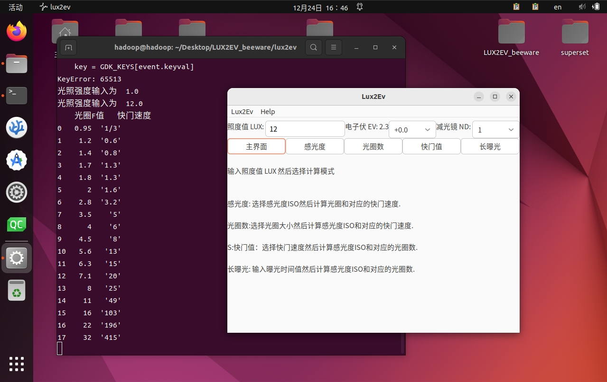

# LUX2EV_beeware 说明文档

一个基于 BeeWare 框架和 Toga 图形界面库实现的摄影曝光参数计算工具

## 1. 软件简介

LUX2EV_beeware 是一个用于摄影曝光参数计算的图形界面工具软件，开发所用的计算机编程语言为 Python 语言，使用的开发框架为 BeeWare，所用图形界面库为 Toga。

### 1.1 开发背景

摄影工作中，曝光参数是非常重要且复杂的概念。曝光参数决定了照片的明暗程度、细节展现和色彩准确性，直接影响着照片的质量和表现力。

曝光参数包括光圈、快门速度和ISO感光度。光圈控制着进入相机的光线量，决定了景深和图像的清晰度。快门速度控制着相机曝光的时间长度，影响到运动物体的清晰度和拍摄静态场景时的稳定性。ISO感光度决定了相机对光线的敏感程度，影响到图像的噪点和细节捕捉能力。

正确设置曝光参数是摄影师必须掌握的技能之一。过曝（过亮）或欠曝（过暗）都会导致图像质量下降，细节丢失或噪点增加。同时，不同的拍摄场景和主题需要不同的曝光参数来达到理想的效果。例如，拍摄夜景需要较长的快门速度和较高的ISO感光度，而拍摄运动物体需要较短的快门速度和较小的光圈。

由于曝光参数的复杂性，摄影师需要根据实际情况进行调整和平衡。一些摄影师倾向于使用手动模式来完全控制曝光参数，而另一些摄影师则更喜欢使用自动模式或半自动模式来快速获得合适的曝光。

摄影领域中，传统的测光手段是使用专用摄影测光表，但这类设备往往价格高昂且功能和使用寿命都有限制，尤其是难以面对一些需要复杂曝光、多次曝光、组合曝光的各种特殊场景。

针对这一问题，本软件旨在为摄影师提供一个简单易用的工具，在输入对应场景的照度之后，使用者可以自由选择ISO感光度、光圈大小、曝光时间等参数，通过计算得到最佳的曝光参数。

### 1.2 功能简介

本软件的主要功能是根据输入的光度值，选择ISO感光度，并计算出不同光圈下对应的快门速度。

在软件中，用户可以选择不同的ISO感光度，并通过滑动条调整光圈大小，以便在不同光圈下计算出来计算出最佳的曝光参数。摄影师可以更加专注于构图和创作，而不必过多关注曝光参数的调整。

软件的功能流程设计如下：


### 1.3 开发环境

本软件使用的开发环境如下：

| 库       | 版本      | 说明                   |
|----------|----------|------------------------|
| Python   | 3.11.5   | 解释器，提供运行支持   |
| beeware  | 0.3.0    | 项目框架，提供运行框架 |
| briefcase| 0.3.16   | 项目管理器，提供打包支持 |
| toga     | 0.4.1    | 图形界面库，提供图形界面支持 |
| numpy    | 1.26.2   | 数值计算库，提供数值计算支持 |
| pandas   | 2.1.4    | 表格处理库，提供表格处理和CSV文件导出支持 |

## 2. 安装与运行

由于采用了具有跨平台支持的开发环境和基础库，本软件支持多种硬件设备和操作系统环境，也具有多种的安装和运行方式。

### 2.1 硬件环境

本软件运行的硬件设备环境如下：

| 硬件项目                      | 最低配置要求                        |
|----------------------------------|------------------------------------|
| 处理器                             | Intel X86_64、AMD64 64位处理器 或 ARM64 64位处理器，双核心，1GHz 以上频率 |
| 运行内存（RAM）                     | 4 GB 以上                           |
| 空余本地硬盘空间                    | 1 GB 以上                           |


### 2.2 系统环境

本软件运行的操作系统环境如下：

| 操作系统                           | 最低版本要求              | 架构       |
|----------------------------------|-------------------------|------------|
| Windows 10                        | 1809                    | 64位       |
| Ubuntu                           | 22.04.3                 | 64位       |
| Android                          | 13                      | 64位       |

### 2.3 安装与运行

#### 2.3.1 Python 解释器运行

这种运行方式支持Windows、GNU/Linux等多种操作系统，具体步骤包括：

* 先安装 Python 解释器（这一步请参考 Python 官方文档）；
* 然后用 pip 命令安装 beeware、briefcase 和 toga 库；
* 接下来使用 git clone 命令下载本软件的源码；
* 完成下载源码后，进入源码路径；
* 使用 briefcase run 命令运行本软件。

这种运行过程需要在终端（Windows下为Powershell，Linux和macOS下为BASH或ZSH）中执行如下命令：

```Bash
pip install beeware briefcase toga # 安装依赖包
git clone https://github.com/EasyCam/LUX2EV_beeware # 下载源代码
cd LUX2EV_beeware/lux2ev # 进入代码路径
briefcase run # 开始运行
```

界面如下图所示：
{ width=720 }

#### 2.3.2 Windows 下绿色运行

这种运行方式支持 Windows 10 1809 以及以上版本的 Windows 操作系统，具体步骤包括：

* 首先访问[本项目的release页面](https://github.com/EasyCam/LUX2EV_beeware/tree/main/release)；
* 根据语言选择压缩包，带cn字样为中文版本，带en字样为英文版本；
* 下载完成后，解压缩 zip 文件到某一目录；
* 完成解压缩后，到对应目录找到运行文件 LUX2EV.exe，双击运行。


界面如下图所示：
{ width=720 }


#### 2.3.3 Windows 下MSI安装运行

这种运行方式支持 Windows 10 1809 以及以上版本的 Windows 操作系统，具体步骤包括：

* 首先访问[本项目的release页面](https://github.com/EasyCam/LUX2EV_beeware/tree/main/release)；
* 根据语言选择wsi文件，带cn字样为中文版本，带en字样为英文版本；
* 下载完成后，双击 wsi 文件进行安装；
* 完成安装后，到开始菜单中找到 LUX2EV 的启动按钮，点击即可启动软件。

安装如下面几张图片所示：
{ width=720 }
{ width=720 }
{ width=720 }
{ width=720 }

界面如下图所示：
{ width=720 }


#### 2.3.4 Android 平台运行

这种运行方式支持 Android 13 以及以上版本的 Android 操作系统，具体步骤包括：

* 打开 Android 设备上的开发者选项，开启USB调试功能；
* 用 USB 线缆将 Android 设备与电脑连接，同意授权；
* 然后在电脑上安装 Python 解释器（这一步请参考 Python 官方文档）；
* 然后用 pip 命令安装 beeware、briefcase 和 toga 库；
* 接下来使用 git clone 命令下载本软件的源码；
* 完成下载源码后，进入源码路径；
* 使用 briefcase update Android 命令更新配置;
* 使用 briefcase build Android 命令生成 APK 文件;
* 使用 briefcase run Android 命令运行本软件。

这种运行过程需要在终端（Windows下为Powershell，Linux和macOS下为BASH或ZSH）中执行如下命令：

```Bash
pip install beeware briefcase toga # 安装依赖包
git clone https://github.com/EasyCam/LUX2EV_beeware # 下载源代码
cd LUX2EV_beeware/lux2ev # 进入代码路径
briefcase update Android # 更新配置
briefcase build Android # 生成 APK 文件
briefcase run Android # 开始运行
```

注意，上述过程中，beeware框架需要联网下载安装 Android 设备上运行 APP 所需要的第三方组件，因此可能花费较长时间，甚至可能因为网络稳定性等多方面因素而导致中断。

另外，Android 设备由于具有多样的分辨率设置，可能出现界面文字不全等情况，但并不影响软件的正常运行。如下所示：
{ width=720 }

## 3. 功能与使用

考虑到用户占比，接下来的功能与使用相关的介绍以 Windows 10 1809 64位版本为例。
其他操作系统下 LUX2EV 的功能与使用也可以参考这部分内容，逻辑基本一致。

### 3.1 物理原理

根据物理定律可知：
* 根据照度值（lux）可以计算得到电子伏（ev）；
* 电子伏（ev）与感光度（ISO）、光圈数（F）、快门值（S）这几个值存在数学关系。
即：
$$
\begin{aligned}
\text{ev} &= 2 + \log_2\left(\frac{\text{lux}}{10}\right) \\
\text{S} &= \frac{\text{F}^2}{2^{\text{ev}} \times 100 \times \text{ISO}}
\end{aligned}
$$
其中，$\text{ev}$ 为曝光补偿，$\text{lux}$ 为照度值，$\text{ISO}$ 为感光度，$\text{F}$ 为光圈数。

因此，状态切换部分的按钮，可以根据当前的照度值、曝光补偿、减光镜档位，得到对应的电子伏（ev）；
然后，在电子伏（ev）固定的前提下，可以已知感光度、光圈数、快门值重任意一项，计算出其他两项的有限组合。


### 3.2 菜单栏

首先，启动软件，Windows 10 用户可以使用 MSI 安装包安装后，在开始菜单中搜索到 LUX2EV 来启动。
其他操作系统用户可以参考上一章节的内容来启动。

{ width=720 }

软件启动后，首先可以看到主界面，以及主界面上的菜单栏。
需要注意的是，这里的菜单栏可能会随着用户所使用的操作系统不同而稍有形貌上的变化。
但具体功能内容基本一致。

主界面使用快捷键 Ctrl+Q 可以退出软件。
{ width=720 }

菜单栏当中的 Help 项目下有访问主页和检查当前版本两项功能，如下图所示：
{ width=720 }


### 3.3 主界面

软件的主界面从上到下分为三个部分：
* 第一部分为照度控制，包括用于输入照度（单位为LUX）的输入框，选择曝光补偿的筛选器，以及选择减光镜档位的筛选器；
* 第二部分为状态切换，包括五个状态切换按钮：主界面、感光度、光圈数、快门值、长曝光；
* 第三部分为数据呈现，包括当前状态下的次级项目值筛选或输入框，当前状态下的计算按钮，当前数据表格，以及保存结果按钮。

{ width=720 }

### 3.4 照度控制

在照度控制部分，用户可以输入照度，选择曝光补偿，以及选择减光镜档位。
* 照度值单位为 LUX（勒克斯），要求所输入的值必须为正数；
* 输入照度后，中间的电子伏EV值会自动计算出来；
* 曝光补偿筛选器可以选择从-5ev到+5ev范围内的曝光补偿，档位包含了1/3ev和1/2ev；
* 减光镜档位筛选器包含了从1-1024，一共11个减光档位：1即为不减光，2即减光到原来值得1/2，以此类推。

照度控制部分，如果用户不输入照度，默认照度值设置为 0.1 lux，这是为了避免出现零作为分母参与运算的情况。

照度控制部分输入和选择的数值，对于程序全局有效。

### 3.5 状态切换

状态切换部分包含五个状态切换按钮：主界面、感光度、光圈数、快门值、长曝光。
主界面按钮，可以切换到主界面状态；其他几个按钮，是在照度控制的大前提下，提供了多个计算过程：
* 感光度按钮，可以切换到感光度优先状态，即选择感光度，然后计算当前电子伏和感光度下的各个光圈数与对应的快门值；
* 光圈数按钮，可以切换到光圈数优先状态，即选择光圈数，然后计算当前电子伏和光圈数下的各个感光度ISO与对应的快门值；
* 快门值按钮，可以切换到快门值优先状态，即选择快门值，然后计算当前电子伏和快门值下的各感光度ISO与对应的光圈数；
* 长曝光按钮，可以切换到长曝光优先状态，即输入较长的曝光时间作为快门值，然后计算当前电子伏和快门值下的各感光度ISO与对应的光圈数。

状态切换部分的按钮，仅对当前状态有效，即计算按钮所生成的结果只影响当前状态下的数据呈现。

#### 3.5.1 感光度优先状态

感光度优先状态下，界面中有选择器控制ISO，调整范围从 50 到 1024000，一共有39个档位，具体包括：
[50,64,100,125,160,200,250,320,400,500,640,800,1000,1250,1600,2000,2500,3200,4000,5000,6400,8000,10000,12500,16000,20000,25000,32000,40000,50000,64000,80000,100000,128000,160000,200000,256000,512000,1024000]。

这里的ISO调整范围和选值，参考了索尼A450单反相机和索尼A7R5微单相机的参数。
选择好了ISO之后，点击“计算”按钮，就可以在数据呈现部分中给出当前状态下的各档光圈数和对应的快门值。

{ width=720 }

#### 3.5.2 光圈数优先状态

光圈数有限状态下，界面中有选择器控制光圈数，调整范围从 0.95 到 32，一共有18个档位，具体包括：[0.95, 1.2, 1.4, 1.7, 1.8, 2, 2.8, 3.5, 4, 4.5, 5.6, 6.3, 7.1, 8, 11, 16, 22, 32]。

这里的光圈数选好之后，点击“计算”按钮，就可以在数据呈现部分中给出当前状态下的各档感光度和对应的快门值。

{ width=720 }

#### 3.5.3 快门值优先状态

快门值优先状态下，界面中有选择器控制快门值，调整范围从30秒到1/8000秒，一共有55个档位，具体包括：[30, 25, 20, 15, 13, 10, 8, 6, 5, 4, 3.2, 2.5, 2, 1.6, 1.3, 1, 0.8, 0.6, 0.5, 0.4, 1/3, 1/4, 1/5, 1/6, 1/8, 1/10, 1/13, 1/15, 1/20, 1/25, 1/30, 1/40, 1/50, 1/60, 1/80, 1/100, 1/125, 1/160, 1/200, 1/250, 1/320, 1/400, 1/500, 1/640, 1/800, 1/1000, 1/1250, 1/1600, 1/2000, 1/2500, 1/3200, 1/4000, 1/5000, 1/6400, 1/8000]。

这里的快门值选好之后，点击“计算”按钮，就可以在数据呈现部分中给出当前状态下的各档感光度和对应的光圈数。

{ width=720 }
        

#### 3.5.4 长曝光优先状态

长曝光优先状态是对快门值优先状态的一种改进，在快门值有限状态下，只能从固定的55个档位的快门速度中选择一档，而在长曝光优先状态下，允许用户自行输入任意正数的快门值，因此可以用于更长的曝光场景。

这里的快门值输入好之后，点击“计算”按钮，就可以在数据呈现部分中给出当前状态下的各档感光度和对应的光圈数。

{ width=720 }

#### 3.5.5 其他注意事项

本软件内置了对异常情境的预报功能。
当计算得到的快门值小于1/8000秒则会被提示“超过1/8000”。

{ width=720 }

当计算得到的光圈数值超过0.95到32的范围，该软件都会在输出光圈的同时加以提示。
光圈数值大于32的会被提示“光圈可能不够小”，若光圈数小于0.95则会被提示“光圈可能不够大”。

{ width=720 }
{ width=720 }


### 3.6 数据呈现

在结果呈现部分，用户可以看到当前状态下的各个次级项目值，以及计算按钮。
* 各个次级项目值，包括：当前照度、当前电子、当前感光度、当前光圈数、当前快门


### 3.7 结果保存

